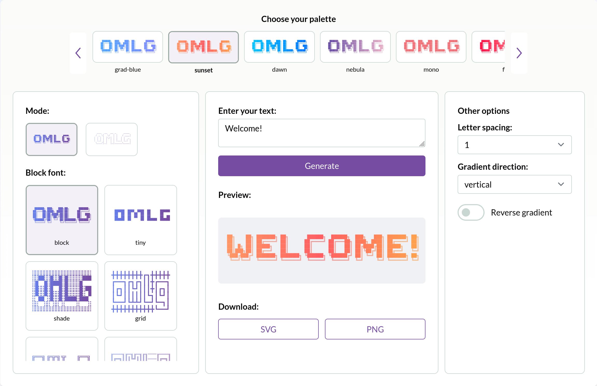

# 🌟 Oh My Logo Generator (OMLG)

Generate stunning **logos instantly** using the power of [Oh My Logo](https://github.com/shinshin86/oh-my-logo).  
With **OMLG** you can create custom logos from text, customize colors, gradients, fonts, and **download them as SVG or PNG**.

---

## 🚀 Features

- ⚡ Instant logo generation from text
- 🎨 Fully customizable (palette, gradient, block font, and more)
- 📥 Download your logos as **SVG** or **PNG**
- 🌐 Ready-to-use web interface
- 🛠️ Powered by the open-source library [Oh My Logo](https://github.com/shinshin86/oh-my-logo)

---

## 📸 Demo

👉 Try it live: [Oh My Logo Generator](https://pucodev.github.io/omlg/)

## 📥 Download Options

- **SVG** → Keep your logo scalable with sharp vector quality.
- **PNG** → Export logos in high resolution (min. 800px wide).

---

## 🤝 Support This Project

This project is open-source and free to use.
If you like it, you can support its development in different ways:

### ⭐ Contribute

- Give a **star** ⭐ to [Oh My Logo](https://github.com/shinshin86/oh-my-logo) — the amazing library that makes this possible.
- Share your logos and tag the project!

### ☕ Buy Me a Coffee

Help me keep building new features and maintaining this tool:

### 🖤 Use & Share

- Use OMLG in your personal or commercial projects.
- Open a PR if you’re using it — we’ll be happy to showcase your project in the README.

---

## 🙏 Credits

Built with love 💜 on top of:

- [Oh My Logo](https://github.com/shinshin86/oh-my-logo) – Open source logo generator library.
- MIT License.

---

## 📜 License

This project is licensed under the **MIT License**.
See [LICENSE](./LICENSE) for details.
